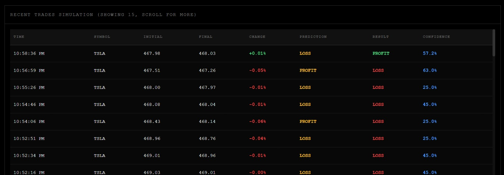
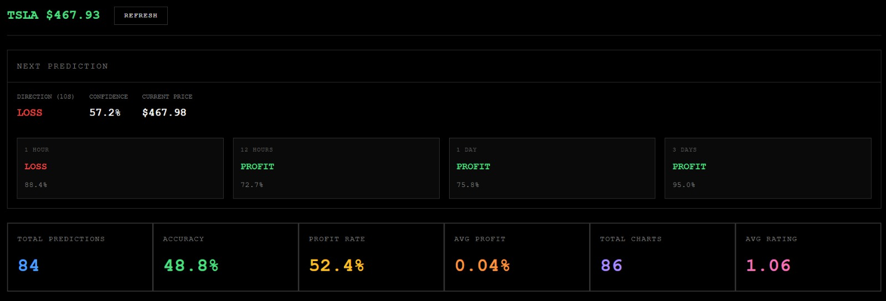
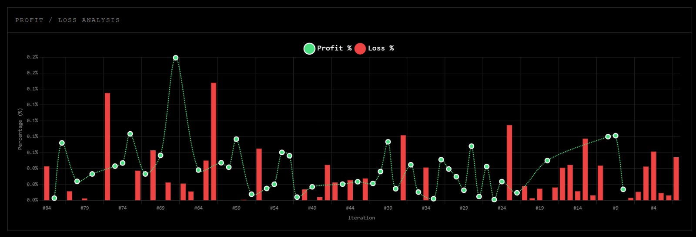

# Trading AI

A reinforcement learning-based trading system with real-time market analysis and web dashboard.



## Overview

Trading AI uses machine learning models to analyze market patterns and make trading predictions. The system features:

- Real-time market data analysis
- Pattern recognition using neural networks
- Web-based dashboard for monitoring
- Technical indicator calculations
- Performance caching and optimization



## Installation

1. Clone the repository:
```bash
git clone <repository-url>
cd trading-ai
```

2. Install dependencies:
```bash
pip install -r requirements.txt
```

3. Run the application:
```bash
python main.py
```

## Usage

The system automatically starts trading analysis and provides a web dashboard at `http://localhost:5000`.

### Key Components

- **Trading AI**: Core reinforcement learning model
- **Pattern Recognizer**: Identifies market patterns
- **Technical Indicators**: Calculates market metrics
- **Web Server**: Provides real-time dashboard
- **Performance Cache**: Optimizes data processing



## Configuration

Default settings:
- Trading symbol: TSLA
- Prediction window: 10 seconds
- Web dashboard port: 5000

## Requirements

- Python 3.7+
- Dependencies listed in requirements.txt
- Internet connection for market data